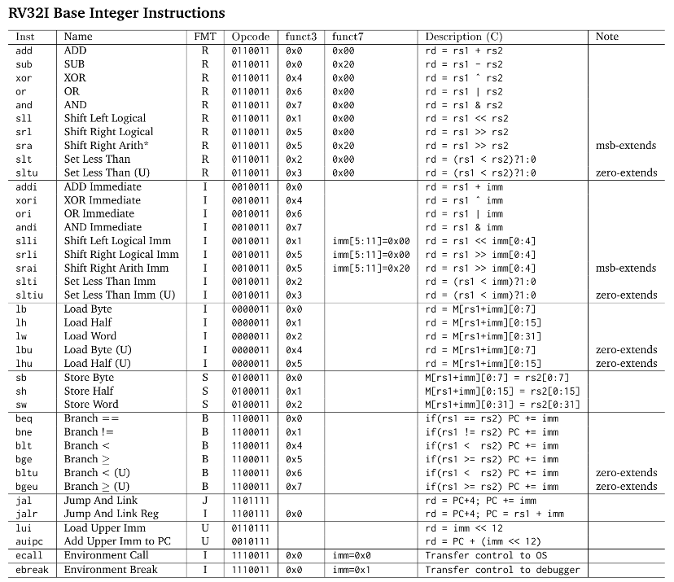

# Computer_Architecture_Lab

## RV32I Instruction Set


### ALU Operation Table

| Operation Name         | Description                  | ALU Opcode  |
|------------------------|------------------------------|-------------|
| ADD                    | Addition                     | 4'b0000     |
| SUB                    | Subtraction                  | 4'b0001     |
| AND                    | Bitwise AND                  | 4'b0010     |
| OR                     | Bitwise OR                   | 4'b0011     |
| XOR                    | Bitwise XOR                  | 4'b0100     |
| SHL_LOGICAL            | Shift Left Logical           | 4'b0110     |
| SHR_LOGICAL            | Shift Right Logical          | 4'b0111     |
| SHR_ARITHMETIC         | Shift Right Arithmetic       | 4'b1000     |
| LESS_THAN              | Compare Less Than (Signed)   | 4'b1001     |


## Instruction Format 

### R-Format
```
| 31–25  | 24–20 | 19–15 |  14–12 | 11–7 |  6–0   |    
| funct7 |  rs2  |  rs1  | funct3 |  rd  | opcode |
```
### I-Format 
```
|    31-20   | 19-15 | 14-12 | 11-7 |  6-0   |   
|  imm[11:0] |  rs1  | func3 |  rd  | opcode |
```
### B-Format    
```
|  31   |  30–25  | 24–20 | 19–15 | 14–12 |  11–8  |   7   | 6–0  |   
|imm[12]|imm[10:5]|  rs2  |  rs1  |funct3 |imm[4:1]|imm[11]|opcode|
```
### S-Format
```
| 31–25     | 24–20 | 19–15 | 14–12  |   11–7   |   6–0   |   
| imm[11:5] | rs2   | rs1   | funct3 | imm[4:0] | opcode  |
```
### U-Format
```
|   31–12    | 11–7 |  6–0   |    
| imm[31:12] |  rd  | opcode |
```

### J-Format
```
|    31   |   30–21   |    20   |    19–12   | 11–7 |   6–0   |  
| imm[20] | imm[10:1] | imm[11] | imm[19:12] |  rd  | opcode  |
```
## Datapath

## Immediate Generator

## Branch comparator

## Reference

RISC-V ISA Page: 
https://msyksphinz-self.github.io/riscv-isadoc/html/rvi.html#
