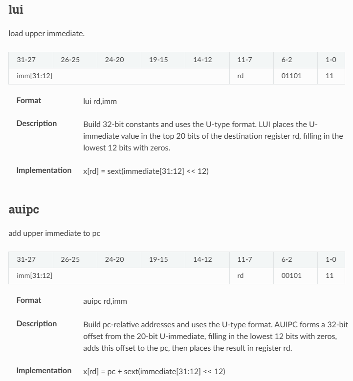

## LUI, AUIPC Debug
LUI, AUIPC instructions are U-format Instruction, with the same instruction format. The difference is the operator to add in ALU, with LUI is 0, with AUIPC is PC value. Therefore, the Control Unit should drive the right input into the ALU from Register file or PC register. 

### LUI — Load Upper Immediate
- **Format**: `lui rd, imm`
- **Description**:  
  Builds a 32-bit constant using the U-type format.  
  The 20-bit immediate value (`imm[31:12]`) is placed into the upper 20 bits of the destination register `rd`, and the lower 12 bits are filled with zeros.
- **Encoding**:

  | Bits    | 31-12      | 11-7 | 6-0    |
  |---------|------------|------|--------|
  | Fields  | immediate  | rd   | opcode |
  | Values  | imm[31:12] | rd   | `0110111` |

- **Implementation**:
  ```c
  x[rd] = sext(immediate[31:12] << 12);
  ```

---
### AUIPC — Add Upper Immediate to PC
- **Format**: `auipc rd, imm`
- **Description**:  
  Forms a 32-bit PC-relative address using the U-type format.  
  It takes the 20-bit immediate (`imm[31:12]`), fills the lower 12 bits with zeros, adds it to the current PC, and stores the result in `rd`.
- **Encoding**:

  | Bits    | 31-12      | 11-7 | 6-0    |
  |---------|------------|------|--------|
  | Fields  | immediate  | rd   | opcode |
  | Values  | imm[31:12] | rd   | `0010111` |

- **Implementation**:
  ```c
  x[rd] = pc + sext(immediate[31:12] << 12);
  ```